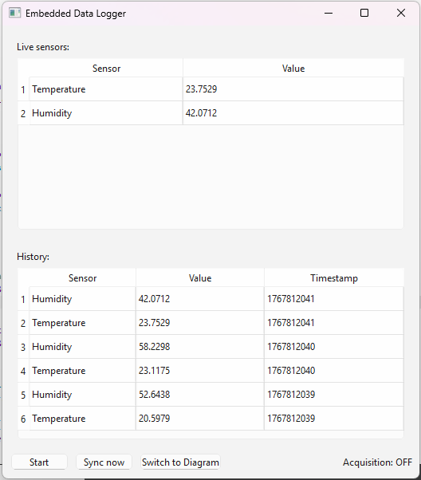
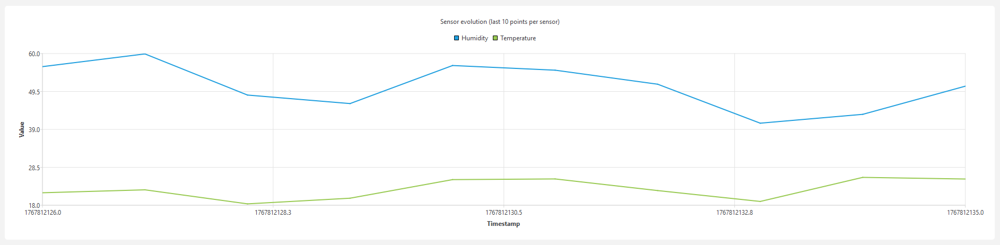

# Embedded Data Logger — Projet C++ / Qt

## Description

Ce projet est un mini data logger embarqué, développé en C++17 et Qt.
Il simule un petit système capable de :
- Lire des capteurs (température, humidité)
- Afficher les valeurs en temps réel
- Enregistrer les mesures dans une base SQLite embarquée
- Synchroniser les données vers un serveur distant via HTTP
- Afficher un historique ou un diagramme d’évolution

Ce projet est majoritairement réalisé avec Chat-GPT, le but étant de m'entrainer aux technologies utlisées et de découvrir les points que je ne maitrise pas encore.
L’objectif est d’avoir un projet court mais complet, montrant les bases d’une application embarquée moderne.

## Aperçu de l’interface

### Vue principale (Live sensors + History)

### Historique sous forme de diagramme

